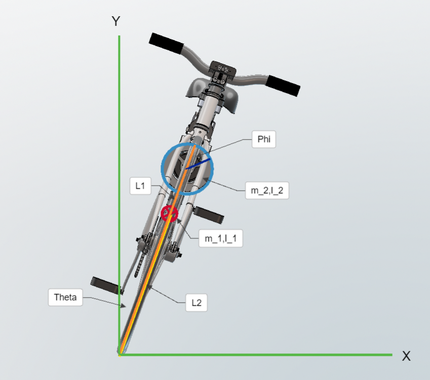
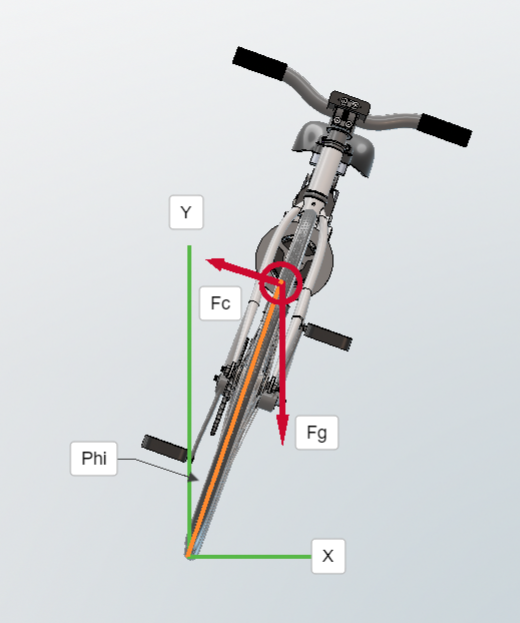

# Self Drinving Bike Study
###### tags: `Inverted Pendulum` `Angular Momentum` `PID Control` `STM32` `Arduino` `Respberry Pi` `MPU6050`  
## Equations
**Angular Momentum**

$L=I\omega$

$\tau=r\times F$

$\tau={dL/dt}$

 

$L$ : Angular Momentum

$I$ : Inertia 

$F$ : Force

$\omega$ : Angular Speed

**Centrifugal Force**

$F=m\frac{v^2}{r}$

 

$F$ : Centrifugal Force

$v$ : 物體的線速度 

$r$ : 旋轉半徑 

**自行車力矩**

$I_t{\ddot{\theta}}+I_2{\ddot{\phi}} =(m_1 l_1+m_2 l_2)g \sin ({\theta}) \cdots \cdots(1)$

$I_2{\ddot{\theta}}+I_2{\ddot{\phi}}=\tau_m \cdots\cdots\cdots\cdots\cdots\cdots\cdots\cdots\cdots (2)$

$I_t=(m_1 l{_1^2}+m_2 l{_2^2}+I_1+I_2)$

 

$\tau_m$ : Torque of the DC motor

$l_1$ : Distance to the center of body

$l_2$ : Distance to the center of wheel

$m_1$ : Mass at the center of body

$m_2$ : Mass at the center of wheel

$I_1$ : Rotational inertia at the center of body

$I_2$ : Rotational inertia at the center of wheel

**自行車離心力**

$\sin\left(\phi\right)=\frac{F_g}{F_c}$

$\phi=\arcsin (\frac{F_g}{F_c})=\arcsin (\frac{v^2}{r.g}) $

## 需了解事項
- 反單擺
- 角動量
- 陀螺儀效應
- MPU6050 或 MPU9250:加速度陀螺儀晶片
- VL53L1X距離傳感器
- STM32
- Arduino
- Respberry Pi
- BLDC(無刷直流馬達)與ESC(電調)
- PWM(Pulse-width modulation)
- 磁場導向控制（field-oriented control，簡稱FOC）
- PID Controller

## References
- [self balancing robot | Simulink basics series](https://www.youtube.com/watch?v=QtmVFlZi5T8)
- [How Brushless Motor and ESC Work and How To Control them using Arduino](https://www.youtube.com/watch?v=uOQk8SJso6Q)
- [Arduino-FOC-reaction-wheel-inverted-pendulum](https://github.com/simplefoc/Arduino-FOC-reaction-wheel-inverted-pendulum)
- [從Arduino LCD上的VL53L1X距離傳感器顯示距離](https://www.youtube.com/watch?v=Lt-Zhm_XY38)
- [Balancing Motorcycle](https://www.youtube.com/watch?v=SUVtObDFFWY&list=RDLV0312BNqIBFI&index=8)
- [Active Gyroscope Balances](https://www.youtube.com/watch?v=UVJx8T8wTQA)
- [Self-Driving Cars - Lecture](https://www.youtube.com/watch?v=ipay3o2kBoU&list=PL05umP7R6ij321zzKXK6XCQXAaaYjQbzr)
- [手把手教你做一輛mini平衡自行車](https://www.eet-china.com/mp/a63913.html)
- [Self balancing bicycle](https://www.youtube.com/watch?v=UzjqdoTVhOU)
- [Reaction-Wheel-Bike](https://github.com/remrc/Reaction-Wheel-Bike)
- [Design and Control of a Self-balancing Bicycle Using an Electric Linear Actuator](https://deepblue.lib.umich.edu/bitstream/handle/2027.42/148871/MastersThesis_FinalDraft%20(3).pdf?sequence=1)
- [Arduino與兩種陀螺儀的使用兼談濾波函式](https://www.youtube.com/watch?v=6lUjqTwy6cA)
- [STM32系列介紹](https://ithelp.ithome.com.tw/articles/10235889)
- [Arduino 教學 CH03-04 HC-SR04 超音波測距模組](https://www.youtube.com/watch?v=PpCpaMx36Fk)
- [《Arduino入門》NANO 08：LCD1602 液晶顯示器](https://www.youtube.com/watch?v=QsBYpf-oGLs)
- [MPU6050 with Raspberry Pi](https://www.youtube.com/watch?v=JTFa5l7zAA4&t=242s)
- [Run TensorFlow Lite on Raspberry Pi for Object Detection](https://www.youtube.com/watch?v=aimSGO倒立擺是什麼？有哪些用途？附PID算法那實現代碼)
- [倒立擺是什麼？附PID算法](https://kknews.cc/zh-tw/tech/y5pm58n.html)

- [維基百科-倒單擺](https://zh.m.wikipedia.org/zh-hant/%E5%80%92%E5%96%AE%E6%93%BA)
- [Lecture - Inverted Pendulum Explanation](https://www.youtube.com/watch?v=OB3ufWYpj-I&list=PLjOmIBPtRZG_ybJMywubA98TfQDGleDtF)
- [Pendulum on cart system](https://www.youtube.com/watch?v=c3z4eo6s0Ek)
- [千年陀螺之謎](https://www.youtube.com/watch?v=9GHkSuQ97WA)
- [FreeCAD](https://www.youtube.com/watch?v=u8otDF_C_fw)
- [KiCad EDA](https://www.kicad.org/)
- [ROS教學 可視化以及模擬](https://www.youtube.com/watch?v=wHsZ4bMAZDI)
- [Openmodelica](https://www.youtube.com/watch?v=SW5Eclf1tRs)
- [Modeling of a Motorcycle in Dymola/Modelica](https://people.inf.ethz.ch/fcellier/MS/schmitt_ms.pdf)
- [Modeling Control and Automatic Code Generation for a Two-Wheeled Self-Balancing Vehicle Using Modelica](https://lup.lub.lu.se/luur/download?func=downloadFile&recordOId=8847398&fileOId=8859286)
- [Modeling Simulation and Control of Inverted Pendulum on a Chart Using Object Oriented Approach with Modelica](http://marjan.fesb.hr/~jmusic/josip_files/dymola_clanak_music.pdf)
- [Presentation-MPC36](https://www.youtube.com/watch?v=wLS1dd5TUk8)
- [Modeling of a Motorcycle in
Dymola/Modelica](https://people.inf.ethz.ch/fcellier/MS/schmitt_ms.pdf)
- [Motorcycle Dynamics Library](https://build.openmodelica.org/Documentation/MotorcycleDynamics.html)
- [Motorcycle Dynamics Library in Modelica](https://modelica.org/events/modelica2006/Proceedings/sessions/Session2b2.pdf)
